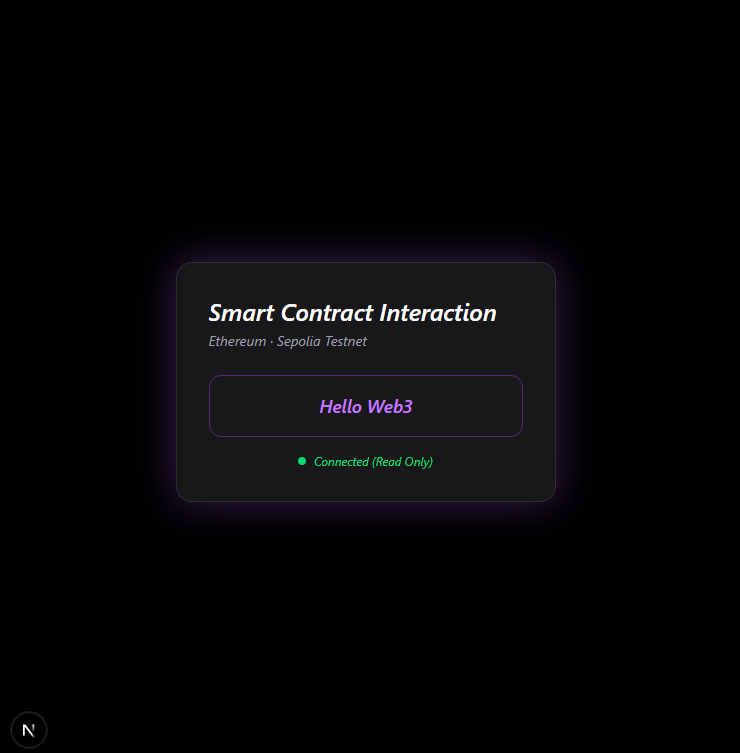

# Smart Contract Interaction dApp

A simple Web3 frontend application that reads data from an Ethereum smart contract.

This project demonstrates how a frontend app can interact with a deployed smart contract using `ethers.js`, without requiring wallet connection or gas fees.

---

## 🚀 Features

- Read data directly from Ethereum blockchain (Sepolia)
- Smart contract interaction using `ethers.js`
- No wallet connection required (read-only)
- Clean and modern Web3 UI
- Built with Next.js App Router

---

## 🛠 Tech Stack

- **Next.js** (App Router)
- **TypeScript**
- **ethers.js**
- **Ethereum Sepolia Testnet**
- **Public RPC Provider**

---

## 📦 Smart Contract

- Network: **Ethereum Sepolia**
- Interaction type: **Read-only**
- Function called: `getMessage()`

The smart contract stores a message on-chain and exposes a public `view` function to retrieve it.
Data is fetched using a public RPC provider without wallet connection.

---

## ⚙️ Installation & Running Locally

Clone the repository:

```bash
git clone https://github.com/your-username/smart-contract-interaction-dapp.git
cd smart-contract-interaction-dapp

Install dependencies
npm install

Run the development server
npm run dev

Open your browser and visit
http://localhost:3000


## 📸 Preview



> **"Hello Web3"**


🧠 Notes

This project focuses on frontend–smart contract interaction

No wallet connection or transaction signing is required

Gas-free because only view functions are used

Suitable as a beginner-to-intermediate Web3 frontend portfolio project

📌 Future Improvements

Wallet connection (MetaMask)

Write interaction (setMessage)

Network switching

Transaction status feedback

